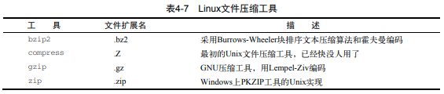

**linux内核：**

- 系统内存管理：通过硬盘上的存储空间来实现虚拟内存(swap space)
- 软件程序管理：内核创建了第一个进程（称为init进程）来启动系统上所有其他进程
- 硬件设备管理：驱动程序代码允许内核与设备之间交换数据
- 文件系统管理：核支持通过不同类型的文件系统从硬盘中读写数据

GNU/Linux shell是一种特殊的交互式工具。命令行提示符是shell负责交互的部分，允许你输入文本命令，然后解释命令，并在内核中执行，用这些命令可以完成诸如复制文件、移动文件、重命名文件、显示和终止系统中正运行的程序等操作。

Ubuntu的Unity，可以使用快捷键Ctrl+Alt+T快速使用GNOME终端器访问CLI。

挂载点（mount point）：虚拟目录会让文件和目录出现在这些挂载点目录结构中，然而实际上它们却存储在另外一个驱动器中。

### Linux目录结构


bin (binaries)存放二进制可执行文件

sbin (super user binaries)存放二进制可执行文件

只有root才能访问 etc (etcetera)存放系统配置文件，usr (unix shared resources)用于存放共享的系统资源，home 存放用户文件的根目录，root 超级用户目录，dev (devices)用于存放设备文件，lib (library)存放跟文件系统中的程序运行所需要的共享库及内核模块，mnt (mount)系统管理员安装临时文件系统的安装点，boot 启动 Linux 时使用的一些核心文件，tmp (temporary)用于存放各种临时文件，var (variable)用于存放运行时需要改变数据的文件


### Linux常见命令

1. `ls`列举当前工作目录内容，`ll`详细显示工作目录内容：

   参数：-F在目录名后加了/；-a显示隐藏文件； -l+空格+文件名（正则表达式）过滤

2. `pwd`(print working directory)显示当前工作目录

3. `cd`(change directory)切换文件路径；`cd /home` 进入绝对路径`/home` 目录' ；`cd A` 当前目录下A子目录 ；`cd .` 当前目录 ；`cd ..` 返回上一级目录 ；`cd ../..` 返回上两级目录 ；`cd ~` 返回用户目录

4. `touch` 创建空文件

7. `rm filename`删除给定文件；`rm -r dir`同时删除该目录下的所有文件（recursive）；-f 强制删除文件或目录（force）

8. `cp dir1/filename1 dir2/filename2`复制文件重命名，不加name2即复制到目录下

   参数：-r 递归持续复制；例：`cp -R Scripts/ Mod_Scripts`创建Mod_Scripts目录成为Scripts目录的副本，`...Mod_Scripts/`Scripts目录复制到在Mod_Scripts目录下

7. `mv filename dir/`移动文件；`mv filename newfilename`；`mv dir1 dir2`移动文件夹重命名

8. `mkdir filename`新建目录；`mkdir -p test1/test2/test3/test4`多层目录

9. `rmdir filename`删除空目录

10. `file my_file`查看文件信息；确定二进制可执行程序编译时所面向的平台以及需要何种类型的库

11. `cat`(concatenate and print files)在标准输出（监控器或屏幕）上查看文件内容

    参数：-n所有的行加上行号

    类似指令：`tail -n x log_file`浏览文件最后x行；`head -n x log_file`浏览文件头部x行

12. `vim filename`进入文件进行修改

13. `man ls`显示ls指令手册；在想要查找的工具的名称前面输入man命令，就可以找到那个工具相应的手册条目

14. `date` 显示系统日期 `date -s "2007-08-03 14:15:00" ` 设置日期和时间

15. `reboot` 重启；`shut down`关机


### 进程和磁盘管理

1. `ps`探查进程

   参数：`-a`显示除控制进程和无终端进程外的所有进程；`-e`显示所有进程

   类似指令：`top`实时检测进程

2. `kill PID`结束进程

3. `mount`输出挂载设备列表，`mount -t type device directory`，type指定文件系统类型：vfat，ntfs等；`mount /dev/hdc6 /mnt/hdc6`挂载到 /mnt/hdc6 

4. `umount [directory|device] `卸载设备，在从光驱中移除CD时先卸载它，然后再去尝试弹出

5. `df`（英文全称：disk full）查看所有已挂载磁盘的使用情况

   参数：`-h` 以人们较易阅读的 GBytes, MBytes, KBytes 等格式自行显示

   例子：`df -h /etc`将 /etc 底下的可用的磁盘容量以易读的容量格式显示

6. `du`（英文全称：disk used）当前目录下所有的文件、目录和子目录的磁盘使用情况

   参数：`-h` 以人们较易阅读的格式显示

7. `fdisk`用于磁盘分区

8. `sort`数据排序

   参数：`-n`按数值排序，`-r`降序

9. `grep [options] pattern [file]`在输入或指定的文件中查找包含匹配指定模式的字符的行

   参数：`-i` 在搜寻时会忽略字符串的大小写，而`-r` 则会在当前工作目录的文件中递归搜寻指定的字符串；`-n`显示匹配模式的行所在的行号；

   例子：`grep [tf] file1`在file1中查找正则表达式-包含t或者f字符的匹配

10. `gzip file`压缩文件；`gzcat file`查看压缩过的文本文件的内容；`gunzip file`解压文件

    

11. `tar function [options] object1 object2 ...`归档数据

    参数：`-c`创建tar归档文件；`-d`检查归档文件和系统文件不同之处；`-x`从tar文件提取文件；`-f`输出结果到文件；`-z`输出重定向给gzip命令来压缩文件；`-v`处理文件时显示文件

    例子：`tar -cvf test.tar test/ test2/`创建一个归档文件；`tar -xvf test.tar`；`tar -zxvf filename.tgz`解压


### shell

1. 查看shell类型：

   用户的默认shell：`cat /etc/passwd`

   系统shell（用于需要在启动时使用的系统shell脚本）：`ls -l /bin/sh`查看软链接指向哪个shell

2. 启动其他shell：`/bin/dash`相当于创建一个子shell；退出：`exit`

3. 命令列表：一系列命令通过`;`隔离，用括号`()`包含命令列表使其成为进程列表

   例：`(pwd ; ls ; cd /etc ; pwd ; cd ; pwd ; ls ; echo $BASH_SUBSHELL) `生成一个子shell执行对应命令，返回数字1表明一个子shell

4. 后台模式：在命令末尾加上字符`&`

   例：`(tar -cf Rich.tar /home/rich ; tar -cf My.tar /home/christine)&`在后台创建备份文件

5. 查看内建命令与外部命令与调用：

   例：`type ps`显示`ps is hashed (/usr/bin/ps)`外部命令，会创建出一个包含全新环境的子进程；`type cd`显示`cd is a shell builtin`内建命令；`/bin/pwd`使用外部命令pwd

6. 内建命令：

   例：查看最近用过的命令列表：`history`；唤回历史列表中任意一条命令：`!n`，n为命令编号

   例：为常用的命令（及其参数）创建另一 个名称：`alias`；用法：`alias li='ls -li'`


### Linux环境变量和文件权限

1. `printenv`命令能看到的全局环境变量；`set`命令会显示出全局变量、局部变量以 及用户定义变量；（如果要用到变量，使用`$`；如果要操作变量，不使用`$`，`printenv`例外），相关操作：

   例： `echo $my_variable`查看环境变量信息，`my_variable="Hello World"` 等号给环境变量赋值，变量名、等号和值之间没有空格；`export my_variable`导出到全局环境；`unset my_variable`删除已经存在的环境变量，子shell操作变量对父shell无效

2. 设置PATH环境变量，修改只能持续到退出或重启系统（存储个人用户永久性bash shell变量的地方是`$HOME/.bashrc`标准启动文件）：

   例：`PATH=$PATH:/home/christine/Scripts`将目录加到PATH环境变量之后，就可以在虚拟目录结构中的任何位置执行程序； `PATH=$PATH:.`当前目录加到PATH环境变量

3. /etc/passwd 文件存储用户信息，包括：root用户账户-Linux系统的管理员，系统账户-系统上运行的各种服务进程访问资源用的特殊账户。将用户密码保存在另一个单独的/etc/shadow文件中，仅root账户可访问

4. `useradd username`创建一个新用户账户

   参数：`-m`创建用户的HOME目录，`-M`相反

5. `userdel username`删除/etc/passwd文件中的用户信息

   参数：`-r`删除用户的HOME目录以及邮件目录

6. 修改用户：`usermod username`修改账户信息：-l修改用户账户的登录名；-L锁定账户，使用户无法登录；-p修改账户的密码；-U解除锁定，使用户能够登录。`passwd username`改变用户密码，`passwd`改变自己的密码

7. 创建组：`groupadd groupname`，`usermod -G groupname username`将用户添加到组中

8. 文件权限：`-rwxrwxr-x 1 rich rich 4882 2010-09-18 13:58 myprog`

   rwx：文件的属主（设为登录名rich）

   rwx：文件的属组（设为组名rich）

   r-x：系统上其他人

   `umask`显示和设置新创建的文件和目录默认权限。采用八进制值，rwx转换成3位二进制值，例如r-x代表101。对文件来说，全权限的值是666，对目录来说是777，减去`umask 022`设定的022之后，剩下的文件权即为新的权限。

9. `chmod 760 newfile`直接用期望赋予文件的标准3位八进制权限码进行安全性设置

10. `chown options owner[.group] file`同时改变文件的属主和属组

### 安装软件程序

**基于Debian的系统：**dpkg命令是基于Debian系包管理系统PMS工具的核心，包含在这个PMS中的其他工具有： apt-get，apt-cache，aptitude(本质上是apt工具和dpkg的前端)

apt默认的软件仓库位置：`/etc/apt/sources.list`

例：`deb (or deb-src) address distribution_name package_type_list`  

deb或deb-src的值表明了软件包的类型。deb值说明这是一个已编译程序源，而deb-src 值则说明这是一个源代码的源。address条目是软件仓库的Web地址。distribution_name条目是这个特定软件仓库的发行版版本的名称，未必就是你使用的发行版。

- 列出所有可更新的软件清单命令：**sudo apt update**

- 用软件仓库中的新版本更新系统上所有的软件包：**sudo apt upgrade**

  列出可更新的软件包及版本信息：**apt list --upgradeable**

  升级软件包，升级前先删除需要更新软件包：**sudo apt full-upgrade**

- 安装指定的软件命令：**sudo apt install <package_name>**

  安装多个软件包：**sudo apt install <package_1> <package_2> <package_3>**

- 更新指定的软件命令：**sudo apt update <package_name>**

- 显示软件包具体信息,例如：版本号，安装大小，依赖关系等等：**sudo apt show <package_name>**

- 删除软件包而不删除数据和配置文件：**sudo apt remove <package_name>**

- 移除软件包及数据和配置文件: **sudo apt purge <package_name>**

- 清理不再使用的依赖和库文件: **sudo apt autoremove**

- 查找软件包命令： **sudo apt search <keyword>**

- 列出所有已安装的包：**apt list --installed**

- 列出所有已安装的包的版本信息：**apt list --all-versions**

**基于Red Hat的系统：**

- yum：在Red Hat和Fedora中使用
- urpm：在Mandriva中使用
- zypper：在openSUSE中使用

`yum install <package_name>`从仓库中安装软件包

`yum list updates`要列出所有已安装包的可用更新

`yum update <package_name>`对包进行更新

`yum remove <package_name>`只删除软件包而保留配置文件和数据文件

`yum erase <package_name>`删除软件和它所有的文件

**从源码安装：**

例：首先需要将sysstat的tarball下载到你的Linux系统上，通常能在各种Linux网站上找到sysstat包，但最好是直接到程序的官方站点下载（http://sebastien.godard.pagesperso-orange.fr/）。

`tar -zxvf sysstat-11.1.1.tar.gz`解压，进入目录，`./configure`，用`make`命令来构建各种二进制文件，`make install`

### 创建shell脚本文件

- 指定shell：在创建shell脚本文件时，必须在文件的第一行指定要使用的shell，其格式为： `#!/bin/bash`，#是注释，shell脚本文件的第一行是个例外，#后面的惊叹号会告诉shell用哪个shell来运行脚本
- 打印信息：在`echo`命令后面加上字符串，控制台显示出这个文本字符串，可用单引号或双引号来划定文本字符串，`echo -n "The time and date are: "`文本字符串和命令输出显示在同一行中
- 环境变量：在环境变量名称之前加上美元符（$）来使用这些环境变量，`echo HOME: $HOME`打印HOME变量，显示美元符号前加反斜杠
- 定义变量：自动决定变量类型；引用一个变量值时需要使用美元符，而引用变量来对其进行赋值时则不要使用美元符；使用等号将值赋给用户变量时在变量、等号和值之间不能出现空格
- 命令输出重定向到文件：`command > outputfile`，`>>`追加输出，输入重定向，`<`，`<<`，例：`date >> test6`
- 管道：管道被放在命令之间，将一个命令的输出重定向到另一个命令中，`command1 | command2`
- 数学运算（只支持整数运算）：`expr ARG1+-*/ARG2`，容易被shell错误解释的字符需要加反斜杠；`$[ operation ]`，例：`var2=$[$var1 * 2]`
- 退出：默认情况下，shell脚本会以脚本中的最后一个命令的退出状态码退出，`$?`是上一个已执行命令的状态码，0为正常退出；`exit [num]`在脚本结束时指定一个退出状态码num


 `sudo passwd`，然后输入当前用户的密码，终端会提示我们输入新的密码并确认，此时的密码就是 root 新密码。
修改成功后，输入命令 `su root`，再输入新的密码。


`ccmake filedirectory`编译。ON/OFF的可以直接用Enter进行切换，修改完之后而按下c键进行配置。等配置结束后，即可继续`make`指令。


Linux+ctrl快捷键：

~~~
ctrl+alt+t：快速打开终端。
ctrl+a: 光标跳到行首。
ctrl+b: 光标左移一个字母。
ctrl+c: 杀死当前进程。
ctrl+d: 删除光标后一个字符或exit、logout。
ctrl+e: 光标移到行尾。
ctrl+f：向后移一个字符。
ctrl+h: 删除光标前一个字符，同backspace键相同。
ctrl+k: 剪切光标后至行尾的内容。
ctrl+l: 清屏，相当于clear。
Ctrl+p：重复上一次命令。
ctrl+r: 搜索之前的命令历史。多次ctrl+r 会一直向上搜索。
ctrl+u: 剪切光标前至行首间的所有内容。
ctrl+w: 剪切前面的字符至上一个空格处。
ctrl+t: 交换光标位置前的两个字符。
ctrl+y: 粘贴或者恢复上次的删除。
Ctrl+x: 跳回之前移动的原位置。
CTRL+SHIFT+T: 在已开终端打开新的Tab
~~~

- 

### cpp file 生成可执行二进制文件

- 预处理（pre-processing）// .i 文件

```sh
# -E         仅作预处理（如处理包含的头文件，宏定义等）
# -o <文件>	  输出到 <文件>
g++ -E test.cpp -o test.i
```

- 编译（compiling）// .s 文件

```sh
# -S      编译到汇编语言
# .s file 汇编语言文件
g++ -S test.i -o test.s
```

- 汇编（assembling）// .o 文件（可重定位目标文件）

```sh
# -c 汇编到机器语言的目标代码
g++ -c test.s -o test.o
```

- 链接（linking）// bin 文件（可执行目标文件）

```sh
g++ test.o -o test
# -g 选项告诉 g++ 产生能被 GNU 调试器 GDB 使用的调试信息，使能够调试程序
g++ -g asd.cpp -o asd
# 使用 -O2 优化源代码，并生成可执行文件
g++ -O2 test.cpp -o test

-O  # 基本的优化，会同时减小代码的长度和执行时间
-O0 # 不做优化
-O1 # 基本的优化
-O2 # 除了完成基本的优化外，还进行一些额外的调整工作，比如指令调整等（常用 ！一般选择 -O2 就够了 ！）
-O3 # 包括循环展开和其他一些与处理特性相关的优化工作

# 链接 myTest 库，指定该库所在目录
g++ -L/home/lpj/myLib -lmyTest test.cpp -o test
# 使用 c++11 标准进行编译
g++ -std=c++11 test.cpp -o test
```

### reference

[基于VSCode和CMake实现C/C++开发 | Linux篇_哔哩哔哩](https://www.bilibili.com/video/BV1fy4y1b7TC?spm_id_from=333.999.0.0)

